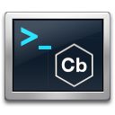

 
## CaBLR (Cobbler) Console

### Utilizes the Carbon Black Sensor API
*Introduced in v5.0*

  https://github.com/carbonblack/cbapi/tree/master/sensor_apis

The Carbon Black Live Response Sensor API allows incident responders to automate investigation and triage activities on any Windows endpoint with the v5.0+ sensor installed.  The API includes a number of built-in functions, including bidirectional file transfer and process execution.  Upload yara and search for signatures or upload your own Powershell scripts to run scripted actions locally.  It does not matter where the sensor is currently located - inside the corporate LAN or at Starbucks, if the sensor is pushing data to the Carbon Black server, the Sensor API can be used for investigations.

## Versioning

The Carbon Black API is versioned.  A new API revision is released in lockstep with each release of the Carbon Black Enterprise Server.

Previous version documentation can be found using git tags.
